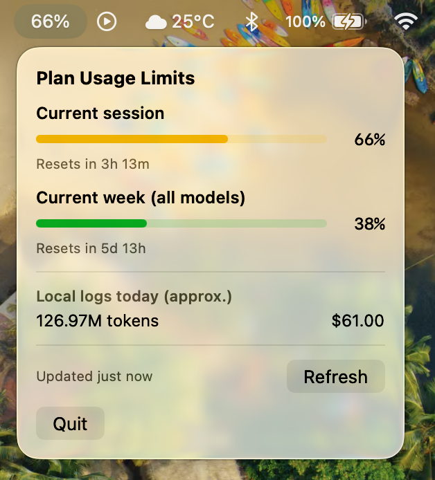

# Claude Usage Menu Bar

A tiny macOS menu bar app that shows how much of your Claude Pro/Max **plan
usage limit** you've burned through — as a live colored ring in the menu bar,
so you can see it at a glance without opening anything.



**In the menu bar:** a ring gauge + percentage for your current session's
usage, colored green (under 60%), amber (60–85%), or red (over 85%).

**Click it for:** current session and current week percentages with reset
countdowns, plus today's local token count and estimated cost.

It requests **zero macOS permissions** — no Photos, Files, Automation, or
anything else. See [Permissions](#permissions).

## Requirements

- macOS 13 (Ventura) or later
- [Claude Code](https://claude.com/claude-code) installed and signed in with a
  **Claude subscription** (Pro/Max). The plan-limit percentages come from your
  subscription; API-key billing has no session/weekly limits to display.
- Xcode **Command Line Tools** (`xcode-select --install`). Full Xcode is *not*
  required.

## Install

```bash
git clone https://github.com/rajatbhagat/claude-usage-menubar.git
cd claude-usage-menubar
./build_app.sh
```

That produces `ClaudeUsageMenuBar.app` in the project directory. Move it where
you want it and launch it:

```bash
mv ClaudeUsageMenuBar.app /Applications/
open /Applications/ClaudeUsageMenuBar.app
```

The app is ad-hoc signed, not notarized, so on first launch macOS may warn that
it's from an unidentified developer. Right-click the app → **Open** → **Open**
to get past it once; subsequent launches are fine.

There's no Dock icon or window — look for the ring in your menu bar. Quit from
the popover's **Quit** button.

### Start it automatically at login

System Settings → General → Login Items → **+** → select
`ClaudeUsageMenuBar.app`.

### Run without building an app bundle

```bash
swift build -c release
.build/release/ClaudeUsageMenuBar
```

## How it works

**Plan usage (the ring).** Runs Claude Code's own `/usage` command
(`claude -p '/usage' --output-format json`) every 30 seconds, and again the
moment you open the popover, then parses the session and weekly percentages
out of the response. This is the same data source Claude Code itself uses to
render "Plan usage limits" — not a reverse-engineered API endpoint — so the
numbers match what you see on claude.ai.

Checking your usage this way costs nothing: `/usage` makes no model call
(`total_cost_usd: 0`, zero tokens), so the widget never eats into the very
allowance it's reporting on.

**Local token stats (the bottom section).** Reads your own Claude Code session
logs at `~/.claude/projects/**/*.jsonl`, tailing them incrementally by byte
offset so it stays cheap as logs grow. It counts each assistant turn's `usage`
block once (deduplicated by `requestId`) and prices it using the table in
`Sources/ClaudeUsageMenuBar/UsageModels.swift`. "Today" resets at local
midnight. A model missing from that pricing table still contributes tokens but
no cost, and the popover flags that so the total isn't silently understated.

No API key, no network calls of its own, no telemetry.

## Permissions

The app requests **no macOS permissions at all**: no entitlements, no
`Info.plist` usage-description keys, no Photos/Music/Files/Automation access.
You can verify before running it:

```bash
codesign -d --entitlements :- /Applications/ClaudeUsageMenuBar.app   # prints nothing
plutil -p /Applications/ClaudeUsageMenuBar.app/Contents/Info.plist   # only basic bundle keys
```

Getting to zero took some doing, and the reason is worth knowing if you're
writing something similar: **macOS launches GUI apps with a working directory
of `/`, and subprocesses inherit it.** Spawning `claude` from the app therefore
made it treat the entire filesystem root as its project directory and scan from
there — walking into `/Volumes` (network shares) and your home folder (Desktop,
Photos, Music) and triggering permission prompts for all of them. The tell was
a project directory registered at `~/.claude/projects/-`, the flattened form of
`/`.

The fix is `process.currentDirectoryURL`, pointed at an empty app-owned temp
directory so `claude` has nothing to discover. The app also runs it with
`--safe-mode` (no plugins, MCP servers, hooks, or CLAUDE.md loading),
`--no-chrome`, `--tools ""`, and `--no-session-persistence` (without which each
poll wrote a transcript file — roughly 1,400 a day).

## Troubleshooting

**The ring shows a dash and the popover says "Couldn't find the claude CLI".**
The app looks for `claude` in `~/.local/bin`, `/opt/homebrew/bin`,
`/usr/local/bin`, and nvm's versioned node directories. If yours is elsewhere,
run `which claude` and add that path to `resolveClaudeExecutable()` in
`Sources/ClaudeUsageMenuBar/PlanUsage.swift`.

**"Live percentages unavailable right now".** `claude -p '/usage'` returned
without percentages. It retries automatically every 30 seconds; the local token
stats stay accurate meanwhile. If it persists, check that `claude` runs and
that you're signed in with a subscription rather than an API key.

**The percentage looks lower than claude.ai.** Open the popover — it refreshes
on open. Usage can climb several percent per minute under heavy use, so a
background reading can lag briefly.

## Development

```bash
swift build          # debug build
swift build -c release
./build_app.sh       # release build + .app bundle + ad-hoc signing
```

Source layout:

| File | Purpose |
| --- | --- |
| `App.swift` | `MenuBarExtra` scene, accessory activation policy (no Dock icon) |
| `PlanUsage.swift` | Runs and parses `claude -p '/usage'` |
| `PlanUsageStore.swift` | Polling, refresh state |
| `LogScanner.swift` | Incremental tailing of `~/.claude/projects/**/*.jsonl` |
| `UsageStore.swift` | Local token/cost aggregation |
| `UsageModels.swift` | Usage totals and the model pricing table |
| `GaugeViews.swift` | Ring and bar gauges |
| `UsageMenuView.swift` | Popover UI |

Note that `build_app.sh` signs ad-hoc (`codesign -s -`), which produces a
different signature on every build. If you later add a capability that *does*
need a permission, macOS will treat each rebuild as a new app and re-prompt;
use a stable self-signed identity at that point.

## License

MIT
